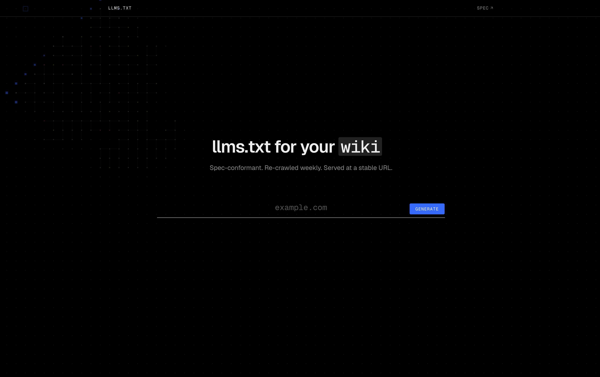
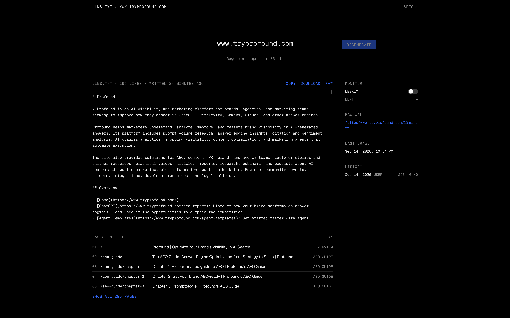
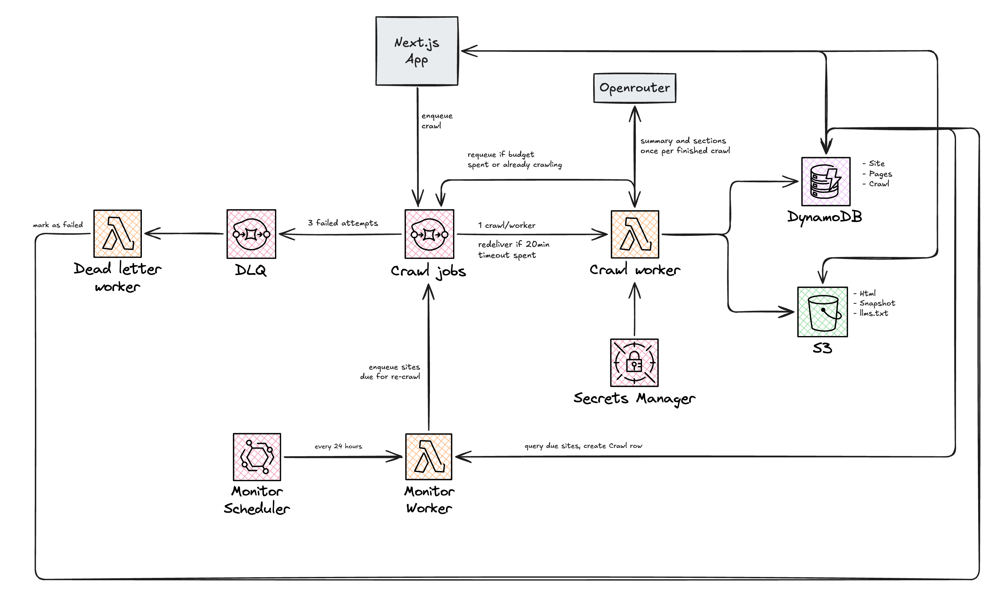
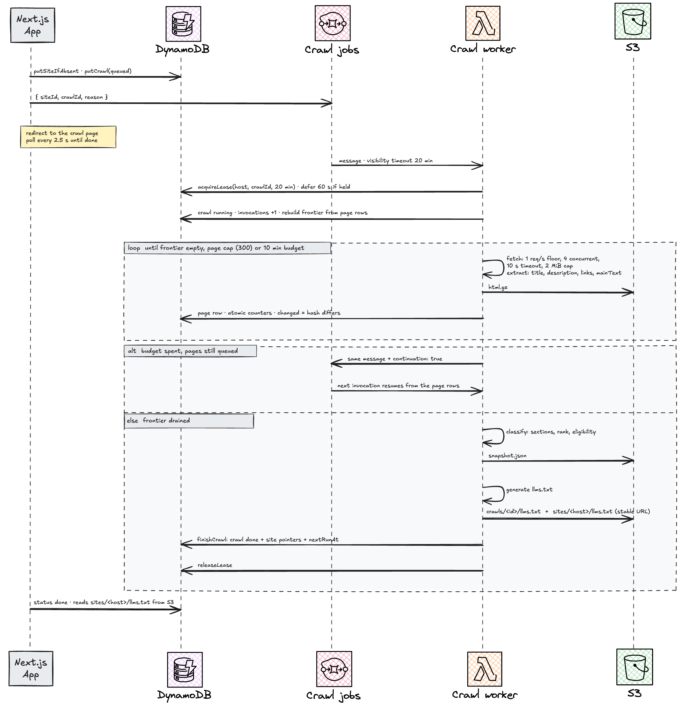
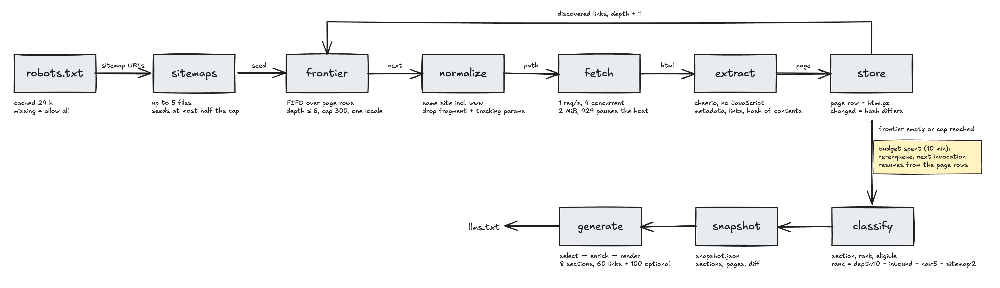

# LLMS.txt Agustin Aon - Profound Challenge

The goal of this challenge is to develop a tool that automatically generates an `llms.txt` file by analyzing any websites structure and content. Additionally, it should alow keeping the `llms.txt` file updated through website changes.

My take at this challenge is below. 

https://llms-txt.agustinaon.com/




## Contents

- [LLMS.txt Agustin Aon - Profound Challenge](#llmstxt-agustin-aon---profound-challenge)
  - [Contents](#contents)
  - [What it does](#what-it-does)
  - [Architecture](#architecture)
    - [System](#system)
    - [One crawl, end to end](#one-crawl-end-to-end)
    - [Crawler pipeline](#crawler-pipeline)
    - [Data model](#data-model)
    - [Web app](#web-app)
    - [Monitoring](#monitoring)
    - [Packages](#packages)
    - [Local development](#local-development)
  - [Decisions](#decisions)
  - [Known limits](#known-limits)
  - [Setup](#setup)
  - [Deploying](#deploying)
  - [Testing](#testing)
  - [Repo layout](#repo-layout)

## What it does

1. Submit a URL. The app normalizes it to an origin, creates the Site and Crawl rows, and sends one SQS message. The web app never crawls.
2. Watch the crawl. The page polls every 2.5 s and shows phase, per-page outcomes, counters and elapsed time.
3. Get the file. Copy, download, or fetch it from the stable raw URL `/sites/<host>/llms.txt`.
4. Turn on monitoring. A weekly re-crawl republishes the file at the same URL and the site page shows what changed: pages added, removed, changed.

## Architecture

The architecture of this tool is simple, yet scalable, fault tolerant and cheap to run.

- Simple: consists of only three moving parts, a web app that writes rows and a message, a worker that crawls, and a sweep that decides when to crawl again.
- Scalable: every crawl is one SQS message and every message is one Lambda, so a hundred sites crawl the same way one does.
- Fault tolerant: progress lives in DynamoDB rows and not in a process, so a worker can die at any point and the next invocation picks up where it left off.
- Cheap: everything is pay per request and an idle deployment costs close to nothing.

The rest of this section shows how: the system as deployed, one crawl from URL to file, the crawler pipeline, and the data model that ties them together.

### System



**What to notice:** the crawler runs on Lambda. A crawl is bursty work: a site is fetched once, then nothing happens for a week. A long-running process would sit idle most of the time and would need its own scaling, health checks and a deploy pipeline. Lambda scales to zero when there is nothing to crawl, scales out to one invocation per queued message when there is, and costs only for the seconds it runs. The price of that choice is the 15-minute cap, which forced the crawl to be resumable from its own rows from the start. That constraint turned out to be the feature: once a crawl can resume, the same mechanism gives redelivery on a throw, deferral when another crawl holds the site, and a dead-letter handler that marks a crawl failed after three attempts, none of which needed extra code paths.

### One crawl, end to end




**What to notice:** three numbers and their order.

| Fetch budget | Lambda timeout | Lease = SQS visibility timeout |
| ------------ | -------------- | ------------------------------ |
| 10 min       | 15 min         | 20 min                         |

- The 5 minutes between budget and timeout pay for classify, the snapshot, the LLM call and the S3 writes, which only run once the frontier is drained.
- The lease outlives the Lambda, so an invocation killed by the platform still can own the job when SQS redelivers the message.
- The lease can be retaken by the crawl id that holds it. That is what makes continuations work: after 10 minutes the worker re-enqueues and returns, the next invocation starts seconds later while the lease still has 10 minutes left, and it takes it back without waiting for it to expire.
- A different crawl on the same site cannot take the lease, so it re-enqueues itself with a 60 s delay and returns without fetching or burning a receive.

### Crawler pipeline




**What to notice:** classification runs once after all fetching, not per page. Rank needs inbound links from the whole site, so on every invocation the link graph is rebuilt from the HTML stored in S3 and ranking happens at the end over everything the crawl reached. That is also why the frontier is a plain FIFO over page rows rather than a priority queue: order of discovery is good enough for fetching, and importance is decided afterwards with full information. The generator never reads page rows or HTML; the snapshot is its whole input.

### Data model

One DynamoDB table, one partition per site, so a site page is one Query.

| Entity | pk            | sk             | Holds                                                                                                                                        |
| ------ | ------------- | -------------- | -------------------------------------------------------------------------------------------------------------------------------------------- |
| Site   | `SITE#<host>` | `SITE`         | origin, config (pageCap, maxDepth, concurrency, scheduleHours), cached robots, lease, latest/lastDone crawl ids, current file key, nextRunAt |
| Crawl  | `SITE#<host>` | `CRAWL#<ulid>` | status, reason, phase, invocations, counters, snapshot/file keys, diff, error, timestamps                                                    |
| Page   | `SITE#<host>` | `PAGE#<path>`  | one row per URL shared across crawls: status, extracted metadata, section, rank, eligible, contentHash, firstSeen/lastSeen/lastChanged       |

- GSI1 `CRAWL#<crawlId>` / `<status>#<path>`: the frontier is a prefix query on `queued#`, the visited set on `fetched#`. This is what lets a new Lambda resume a crawl.
- GSI2 `SCHEDULE` / `<nextRunAt>#<host>`: sparse, written only while monitoring is on. The daily sweep is one Query with `sk <= now#~`.
- Crawl ids are ULIDs, so newest-first history is a reverse range query with no extra index.
- Paths over 900 bytes get a hashed sort key. The S3 html key hashes the path too.

S3, versioned:

```
sites/<host>/llms.txt                        stable URL, overwritten each crawl
sites/<host>/crawls/<crawlId>/llms.txt        immutable copy per crawl
sites/<host>/crawls/<crawlId>/snapshot.json   input to the generator
sites/<host>/crawls/<crawlId>/html/<sha256>.html.gz
```

### Web app

| Route                       | Reads                                                              | Writes                               |
| --------------------------- | ------------------------------------------------------------------ | ------------------------------------ |
| `/`                         | nothing                                                            | Site and Crawl rows, one SQS message |
| `/sites/<host>/crawls/<id>` | Crawl row, its Page rows via GSI1                                  | nothing                              |
| `/sites/<host>`             | Site row, last 20 crawls, eligible pages, the current file from S3 | monitor toggle                       |
| `/sites/<host>/llms.txt`    | the file at `site.currentLlmsTxtKey`                               | nothing                              |

- The crawl page polls every 2.5 s while the tab is visible and stops when the crawl is done or failed. It never touches S3 while the crawl runs; the file is loaded only once the status is done.
- Polling instead of SSE or WebSockets: the app runs on Amplify SSR compute with no long-lived connections, and the crawl row is already the source of truth, so a refresh is just a re-render.

### Monitoring

- Turning monitoring on writes `scheduleHours` (168) on the site and `nextRunAt` with its GSI2 keys. Turning it off removes all of them together, so the index stays sparse and a site can never have an index entry without a due time.
- EventBridge Scheduler invokes the sweep every 24 hours. The sweep is one Query on GSI2 for `nextRunAt <= now`, limited to 100 sites.
- When the crawl finishes, `finishCrawl` rewrites `nextRunAt` from the real finish time, so drift does not accumulate.

### Packages

| Package             | Role                                                                                   | AWS?                            |
| ------------------- | -------------------------------------------------------------------------------------- | ------------------------------- |
| `packages/core`     | entities, key builders, store interfaces, in-memory implementations, URL normalization | only under `@llms-txt/core/aws` |
| `packages/crawler`  | robots, sitemap, frontier, fetch, extract, classify, snapshot                          | no                              |
| `packages/llms-txt` | select, enrich, render, parse                                                          | no                              |
| `apps/worker`       | the three Lambda handlers plus enqueue/status scripts                                  | yes                             |
| `apps/web`          | Next.js app                                                                            | via core                        |
| `infra`             | CDK stack, imports table layout, timings and env names from the packages               | yes                             |

Dependencies point one way. `crawler` and `llms-txt` depend on `core` for entities and interfaces; `worker` and `web` depend on all three; `infra` imports the table layout, the timings and the env var names from `core` and `worker`. Nothing imports from an app, and the only AWS SDK imports are under `@llms-txt/core/aws` and in the two apps. Renaming a key attribute or an env var is a compile error in the stack, not a runtime surprise.

### Local development


- No emulator. `pnpm --filter @llms-txt/web env:local` reads the CloudFormation outputs into `.env.local` and `next dev` talks to the real table, bucket and queue.
- The CLI crawl needs nothing deployed. It runs the same crawler and generator on the in-memory store and prints the file.
- Worker scripts enqueue a crawl and watch its status against the deployed stack, the same path the web app takes.
- Tests need Docker only for the DynamoDB contract cases and skip them when it is missing, so CI without Docker stays green.

## Decisions


**Crawling**

- The crawler is polite by default, and that costs speed on purpose. It identifies itself with a user agent that links to this repo, honours robots.txt, never sends more than one request per second to a host, keeps at most 4 in flight, treats a 429 or 503 as the site asking it to stop and pauses the whole host rather than the one request, and gives up on the crawl after four pauses in a row.
- Batch size 1 on both queues. A throw retries exactly one job and there is no partial-batch bookkeeping.
- Terminal errors are written to the crawl row and swallowed. Only retryable errors throw. A persistent 429 fails the crawl rather than retrying it three times.
- Sitemaps are hints. Unreachable or malformed ones are ignored, and only half the page cap can be seeded from them so the homepage's own links still fit.
- One locale per crawl. Whatever locale the landing page ends up in is the one followed. Translations add pages without adding information.
- Change detection is a sha256 of the main text with nav, header, footer, aside, scripts and styles removed, so a rotating footer year does not mark every page as changed.

**Generating the file**

- The LLM only ever writes words: a one-sentence summary, up to two paragraphs of about text, and optional section labels. It never sees or picks a URL. Link selection is deterministic.
- The model reads the landing page text only. Everything else it gets is titles and paths.
- Notes are the page's own meta description or nothing. The file never invents one.
- Link budget is shared by section weight (sum of 1/(rank+1)), so a heavy section listed late is never starved by a light one listed first. Caps: 8 sections, 15 links per section, 60 main links, 100 optional.

**Storage and infra**

- `finishCrawl` is one transaction over the crawl and site rows. Releasing the lease is deliberately outside it.
- The monitor pushes `nextRunAt` forward before enqueuing, so a running scheduled crawl is never enqueued twice; the finish then sets it again from the real finish time.
- Pinned AWS SDKs are bundled into the Lambdas rather than taken from the runtime.
- Everything is `RemovalPolicy.DESTROY`. This is a take-home, nothing should survive `cdk destroy`.

## Known limits

- No JavaScript rendering. Static HTML only, via cheerio. A client-rendered site yields a file that lists pages but says little about them, and the UI says so.
- `ETag` and `Last-Modified` are stored but not sent back. Re-crawls download every page again; change detection is content-hash based.
- One schedule interval in the UI, weekly. The CLI can set any number of hours.
- No auth and no rate limiting beyond the per-site 1-hour re-crawl cooldown.
- No listing of all known sites.
- Sweep runs daily, so a weekly site re-crawls within a day of being due.
- Pagination has no special handling beyond the prefix and query caps.

## Setup

Requirements: Node 24, pnpm 12 (`corepack enable`), Docker for the DynamoDB tests, AWS credentials in the usual chain.

```bash
pnpm install
pnpm check        # biome + typecheck
pnpm test
```

Crawl a site locally with nothing deployed (in-memory store, prints the file):

```bash
pnpm --filter @llms-txt/crawler crawl https://example.com --print [--pages 50] [--budget 60] [--no-ai]
```

Set `OPENROUTER_API_KEY` (and optionally `OPENROUTER_MODEL`, default `openai/gpt-5.6-luna`) in `packages/crawler/.env` to get the summary and about text. Without it the file is written from the crawl alone.

Run the web app against the deployed stack:

```bash
pnpm --filter @llms-txt/web env:local   # writes apps/web/.env.local from the stack outputs
pnpm --filter @llms-txt/web dev
```

Worker scripts, also against the deployed stack:

```bash
pnpm --filter @llms-txt/worker enqueue https://example.com [--pages N] [--schedule HOURS]
pnpm --filter @llms-txt/worker status example.com [crawlId] [--watch] [--file]
```

## Deploying


```bash
pnpm --filter @llms-txt/infra exec cdk bootstrap   # once per account/region
pnpm --filter @llms-txt/infra deploy                # also: synth, diff, destroy
```

The stack creates the table, bucket, queues, the three Lambdas, the schedule and the Amplify app. After the first deploy:

1. Put a real key in the `OpenRouterApiKey` secret (its ARN is a stack output). Until then the worker logs that no key is configured and writes files without the model.
2. Install the Amplify GitHub App for the stack's region on the repo and store a classic PAT with `admin:repo_hook` as the `llms-txt/github-token` secret. Amplify then builds `main` on every push. The `WebUrl` output is the site.

Configuration lives in code: `TIMING` and `DEFAULT_SITE_CONFIG` in `packages/core/src/defaults.ts`, render caps in `packages/llms-txt/src/select.ts`, the sweep rate and Lambda sizes in `infra/lib/llms-txt-stack.ts`.

## Testing


- Every package tests against in-memory implementations of the store, file store and queue. No mocks of AWS clients, no network.
- The crawler tests run against a fake site with one of each trap: duplicate page, noindex, robots-disallowed path, same-host redirect, off-site redirect, a route that 500s twice, a route that 429s once, a PDF, mailto/tel/javascript links, a tracked and untracked link to the same post, a sitemap-only page.
- The store contract suite runs against the Maps and against DynamoDB Local in Docker. Without Docker those cases skip.
- The CDK stack is synthesized once and asserted on: visibility timeout equals the lease TTL, batch size 1 on both queues, `rate(1 day)`, versioned bucket, the Amplify env vars.
- CI runs `pnpm check:ci` and `pnpm test` on every push and pull request.

## Repo layout

```
apps/web          Next.js app: submit, crawl view, site page, raw file route
apps/worker       Lambda handlers: crawl-job, monitor, dead-letter; enqueue and status scripts
packages/core     entities, key builders, store interfaces, memory + AWS implementations
packages/crawler  robots, sitemap, frontier, fetch, extract, classify, snapshot, CLI
packages/llms-txt select, enrich (OpenRouter), render, parse
infra             CDK stack and its test
```
